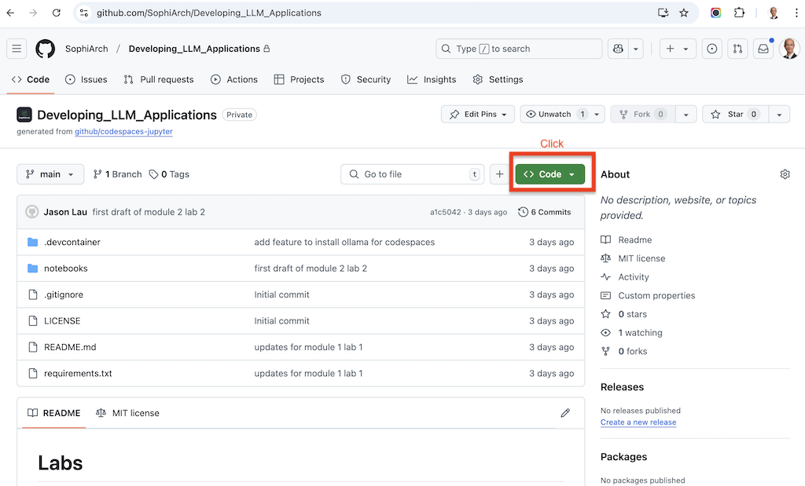
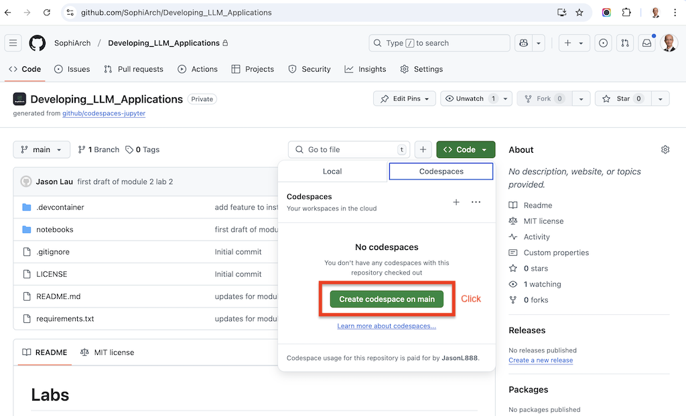
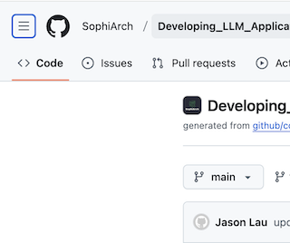
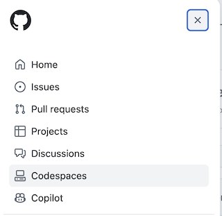
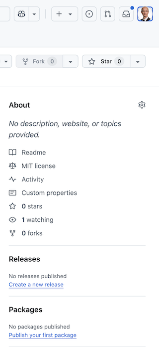
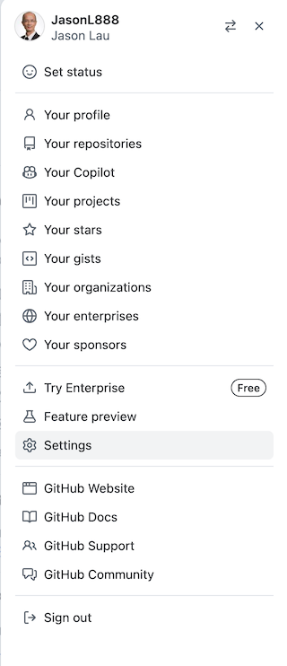
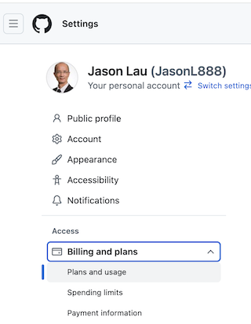
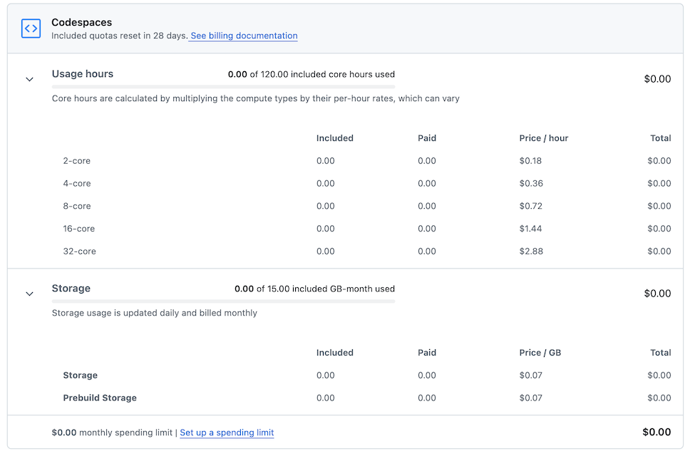

# Labs

## Usage
- Create a codespace
    - on this github repository
        - click on `Code` (green button)
        

        - click on `Create codespace on main`
         

- Launches Virtual Machine (VM) codespace 
    - direct access from the browser

> Be patient:
> - startup might be slow due to Ollama installation 

## Available Labs
- [Module 2 Lab 1 LLM API - Cloud](./notebooks/module2_lab1_cloud_api.ipynb)
- [Module 2 Lab 2 LLM API - Local](./notebooks/module2_lab1_local_api.ipynb)

# Costs
- at time of writing, GitHub Free for personal accounts includes
    - [120 hours free core hours per month](https://docs.github.com/en/billing/managing-billing-for-your-products/managing-billing-for-github-codespaces/about-billing-for-github-codespaces#monthly-included-storage-and-core-hours-for-personal-accounts)
- To minimize unnecessary billings,
    - Do stop and delete your unused codespaces
    - By clicking on the &#9776; (hamburger icon on top left)
    
    - navigate to CodeSpaces
    
    - if nothing listed
        - all good with no codespaces running or stopped
    - else 
        - codespaces VMs are running or stopped
            - if not using, stop and delete 

- Monitor your codespaces quota usage from "Profile > Settings > Access > Billings and plans"
    - Click on your profile icon (top right)
    
    - Select "Settings"
    
    - on "Settings" panel (left)
        - click on "Access"
        - click on "Billings and plans"
        
        - scroll down to view your code spaces usage
        

